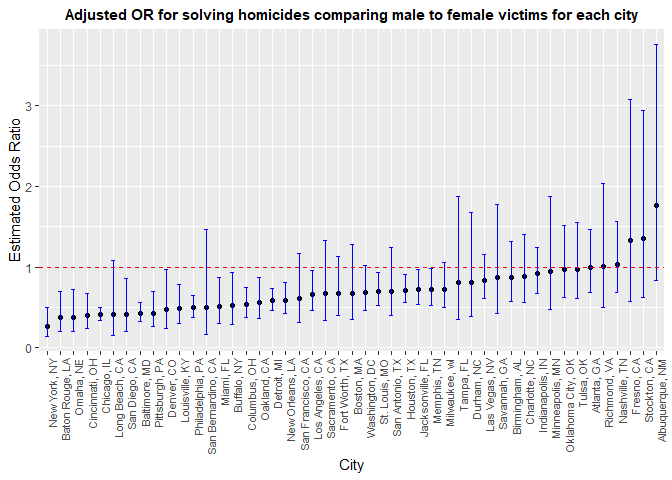
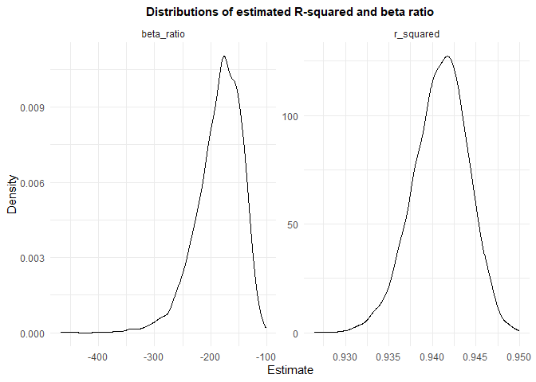

p8105_hw6_bz2570
================
Boran Zhai
2025-11-23

## Problem 1

``` r
homicide_df = 
  read_csv("data/homicide-data.csv") |> 
  janitor::clean_names() |> 
  mutate(
    city_state = str_c(city, ", ", state),
    resolved = as.numeric(disposition == "Closed by arrest"),
    victim_age = as.numeric(victim_age)
  ) |> 
  filter(
    !city_state %in% c("Dallas, TX", "Phoenix, AZ", "Kansas City, MO", "Tulsa, AL"),
    victim_race %in% c("White", "Black")
  )
```

    ## Rows: 52179 Columns: 12
    ## ── Column specification ────────────────────────────────────────────────────────
    ## Delimiter: ","
    ## chr (9): uid, victim_last, victim_first, victim_race, victim_age, victim_sex...
    ## dbl (3): reported_date, lat, lon
    ## 
    ## ℹ Use `spec()` to retrieve the full column specification for this data.
    ## ℹ Specify the column types or set `show_col_types = FALSE` to quiet this message.

    ## Warning: There was 1 warning in `mutate()`.
    ## ℹ In argument: `victim_age = as.numeric(victim_age)`.
    ## Caused by warning:
    ## ! NAs introduced by coercion

**For the city of Baltimore, MD**

``` r
# Fit a logistic regression and save the output
baltimore_df = 
  homicide_df |> 
  filter(city_state == "Baltimore, MD") |> 
  select(resolved, victim_age, victim_sex, victim_race)

baltimore_fit = 
  baltimore_df |> 
  glm(resolved ~ victim_age + victim_sex + victim_race, data = _, family = binomial())

summary(baltimore_fit)
```

    ## 
    ## Call:
    ## glm(formula = resolved ~ victim_age + victim_sex + victim_race, 
    ##     family = binomial(), data = baltimore_df)
    ## 
    ## Coefficients:
    ##                   Estimate Std. Error z value Pr(>|z|)    
    ## (Intercept)       0.309981   0.171295   1.810   0.0704 .  
    ## victim_age       -0.006727   0.003324  -2.024   0.0430 *  
    ## victim_sexMale   -0.854463   0.138176  -6.184 6.26e-10 ***
    ## victim_raceWhite  0.841756   0.174716   4.818 1.45e-06 ***
    ## ---
    ## Signif. codes:  0 '***' 0.001 '**' 0.01 '*' 0.05 '.' 0.1 ' ' 1
    ## 
    ## (Dispersion parameter for binomial family taken to be 1)
    ## 
    ##     Null deviance: 3567.9  on 2752  degrees of freedom
    ## Residual deviance: 3492.7  on 2749  degrees of freedom
    ## AIC: 3500.7
    ## 
    ## Number of Fisher Scoring iterations: 4

``` r
# Obtain the estimate and CI of adjusted OR for solving homicides comparing male to female (all other variables fixed)
baltimore_results = 
  baltimore_fit |> 
  broom::tidy() |> 
  mutate(
    OR = exp(estimate),
    CI_lower = exp(estimate - 1.96 * std.error),
    CI_upper = exp(estimate + 1.96 * std.error) 
  ) |>
  filter(term == "victim_sexMale") |>   
  select(term, log_OR = estimate, OR, CI_lower, CI_upper)

baltimore_results |> 
  knitr::kable(digits = 3,
               caption = "For solving homicides comparing male victims to female victims")
```

| term           | log_OR |    OR | CI_lower | CI_upper |
|:---------------|-------:|------:|---------:|---------:|
| victim_sexMale | -0.854 | 0.426 |    0.325 |    0.558 |

For solving homicides comparing male victims to female victims

In Baltimore, MD, after controlling for victim age and race, the odds
ratio of solving homicides for male victims were 0.426 times the odds
for female victims with 95% confidence interval \[0.325,0.558\],
indicating that homicides with female victims were significantly more
likely to be resolved.

**For all cities**

``` r
# Fit logistic regression and extract adjusted OR and CI for solving homicides comparing male to female
city_or_results = 
  homicide_df |> 
  nest(data = -city_state) |> 
  mutate(
    models = map(data, \(df) glm(resolved ~ victim_age + victim_sex + victim_race, 
                                data = df, family = binomial())),
    results = map(models, broom::tidy)
  ) |> 
  select(-data, -models) |> 
  unnest(results) |> 
  filter(term == "victim_sexMale") |> 
  mutate(
    OR = exp(estimate),
    CI_lower = exp(estimate - 1.96 * std.error),
    CI_upper = exp(estimate + 1.96 * std.error)
  ) |> 
  select(city_state, log_OR = estimate, OR, CI_lower, CI_upper)

city_or_results |>
  knitr::kable(digits = 3,
               caption = "For solving homicides comparing male victims to female victims")
```

| city_state         | log_OR |    OR | CI_lower | CI_upper |
|:-------------------|-------:|------:|---------:|---------:|
| Albuquerque, NM    |  0.570 | 1.767 |    0.831 |    3.761 |
| Atlanta, GA        |  0.000 | 1.000 |    0.684 |    1.463 |
| Baltimore, MD      | -0.854 | 0.426 |    0.325 |    0.558 |
| Baton Rouge, LA    | -0.964 | 0.381 |    0.209 |    0.695 |
| Birmingham, AL     | -0.139 | 0.870 |    0.574 |    1.318 |
| Boston, MA         | -0.395 | 0.674 |    0.356 |    1.276 |
| Buffalo, NY        | -0.653 | 0.521 |    0.290 |    0.935 |
| Charlotte, NC      | -0.123 | 0.884 |    0.557 |    1.403 |
| Chicago, IL        | -0.891 | 0.410 |    0.336 |    0.501 |
| Cincinnati, OH     | -0.917 | 0.400 |    0.236 |    0.677 |
| Columbus, OH       | -0.630 | 0.532 |    0.378 |    0.750 |
| Denver, CO         | -0.736 | 0.479 |    0.236 |    0.971 |
| Detroit, MI        | -0.541 | 0.582 |    0.462 |    0.734 |
| Durham, NC         | -0.208 | 0.812 |    0.392 |    1.683 |
| Fort Worth, TX     | -0.402 | 0.669 |    0.397 |    1.127 |
| Fresno, CA         |  0.289 | 1.335 |    0.580 |    3.071 |
| Houston, TX        | -0.341 | 0.711 |    0.558 |    0.907 |
| Indianapolis, IN   | -0.085 | 0.919 |    0.679 |    1.242 |
| Jacksonville, FL   | -0.329 | 0.720 |    0.537 |    0.966 |
| Las Vegas, NV      | -0.178 | 0.837 |    0.608 |    1.154 |
| Long Beach, CA     | -0.891 | 0.410 |    0.156 |    1.082 |
| Los Angeles, CA    | -0.413 | 0.662 |    0.458 |    0.956 |
| Louisville, KY     | -0.712 | 0.491 |    0.305 |    0.790 |
| Memphis, TN        | -0.324 | 0.723 |    0.529 |    0.988 |
| Miami, FL          | -0.663 | 0.515 |    0.304 |    0.872 |
| Milwaukee, wI      | -0.319 | 0.727 |    0.499 |    1.060 |
| Minneapolis, MN    | -0.054 | 0.947 |    0.478 |    1.875 |
| Nashville, TN      |  0.034 | 1.034 |    0.685 |    1.562 |
| New Orleans, LA    | -0.536 | 0.585 |    0.422 |    0.811 |
| New York, NY       | -1.338 | 0.262 |    0.138 |    0.499 |
| Oakland, CA        | -0.574 | 0.563 |    0.365 |    0.868 |
| Oklahoma City, OK  | -0.026 | 0.974 |    0.624 |    1.520 |
| Omaha, NE          | -0.961 | 0.382 |    0.203 |    0.721 |
| Philadelphia, PA   | -0.701 | 0.496 |    0.378 |    0.652 |
| Pittsburgh, PA     | -0.842 | 0.431 |    0.265 |    0.700 |
| Richmond, VA       |  0.006 | 1.006 |    0.498 |    2.033 |
| San Antonio, TX    | -0.350 | 0.705 |    0.398 |    1.249 |
| Sacramento, CA     | -0.402 | 0.669 |    0.335 |    1.337 |
| Savannah, GA       | -0.143 | 0.867 |    0.422 |    1.780 |
| San Bernardino, CA | -0.692 | 0.500 |    0.171 |    1.462 |
| San Diego, CA      | -0.884 | 0.413 |    0.200 |    0.855 |
| San Francisco, CA  | -0.498 | 0.608 |    0.317 |    1.165 |
| St. Louis, MO      | -0.352 | 0.703 |    0.530 |    0.932 |
| Stockton, CA       |  0.301 | 1.352 |    0.621 |    2.942 |
| Tampa, FL          | -0.214 | 0.808 |    0.348 |    1.876 |
| Tulsa, OK          | -0.025 | 0.976 |    0.614 |    1.552 |
| Washington, DC     | -0.371 | 0.690 |    0.468 |    1.017 |

For solving homicides comparing male victims to female victims

``` r
# Create a plot showing estimated ORs and CIs for each city
city_or_results |> 
  mutate(city_state = fct_reorder(city_state, OR)) |> 
  ggplot(aes(x = city_state, y = OR)) + 
  geom_point() + 
  geom_errorbar(aes(ymin = CI_lower, ymax = CI_upper),
                width = 0.3, color = "blue") + 
  geom_hline(yintercept = 1, linetype = "dashed", color = "red") +
  theme(axis.text.x = element_text(angle = 90, hjust = 1, size = 8)) + 
  labs(
    title = "Adjusted OR for solving homicides comparing male to female victims for each city",
    x = "City", 
    y = "Estimated Odds Ratio"
  ) +
  theme(plot.title = element_text(hjust = 0.5, face = "bold", size = 11))
```

<!-- -->

The plot shows substantial variation in the adjusted odds ratios across
cities, ranging from approximately 0.26 to 1.77. In all cities, 6 cities
had ORs greater than 1, indicating higher odds of resolution for male
victims, while 41 cities had ORs less than 1, suggesting higher odds of
resolution for female victims. In 22 cities, the 95% confidence
intervals didn’t include 1, indicating statistically significant gender
disparities in homicide resolution rates.

## Problem 2

``` r
data("weather_df")
```

``` r
bootstrap_results = 
  weather_df |> 
  janitor::clean_names() |> 
  modelr::bootstrap(n = 5000) |> 
  mutate(
    models = map(strap, \(df) lm(tmax ~ tmin + prcp, data = df)), 
    results_1 = map(models, broom::glance),
    results_2 = map(models, broom::tidy)
  ) |> 
  select(-strap, -models) |> 
  unnest(results_1) |> 
  select(bootstrap_id = .id, r_squared = r.squared, results_2) |> 
  unnest(results_2) |> 
  filter(term %in% c("tmin", "prcp")) |> 
  select(bootstrap_id, r_squared, term, coefficient = estimate) |> 
  pivot_wider(
    names_from = term,
    values_from = coefficient
  ) |> 
  mutate(beta_ratio = tmin / prcp) |> 
  select(bootstrap_id, r_squared, beta_ratio)

bootstrap_results |> 
  head(5) |> 
  knitr::kable(digits = 3, 
               caption = "Above showing first 5 rows of bootstrap_results")
```

| bootstrap_id | r_squared | beta_ratio |
|:-------------|----------:|-----------:|
| 0001         |     0.940 |   -141.907 |
| 0002         |     0.941 |   -247.805 |
| 0003         |     0.940 |   -147.016 |
| 0004         |     0.943 |   -178.749 |
| 0005         |     0.938 |   -142.802 |

Above showing first 5 rows of bootstrap_results

``` r
# Plot the distributions of estimates
bootstrap_results |> 
  pivot_longer(
    r_squared:beta_ratio,
    names_to = "statistic",
    values_to = "estimate"
  ) |> 
  ggplot(aes(x = estimate)) + 
  geom_density() + 
  facet_wrap(~statistic, scales = "free") + 
  labs(title = "Distributions of estimated R-squared and beta ratio",
       x = "Estimate",
       y = "Density"
  ) +
  theme_minimal() +
  theme(plot.title = element_text(hjust = 0.5, face = "bold", size = 11))
```

<!-- -->

Above distributions are derived from 5000 bootstrap samples, reflecting
the variability of the estimated beta ratio and R-squared:

The distribution of beta_ratio is unimodal, which begins with a density
nearly zero at -467, rises obviously, peaks around -186, and then
decreases until the density approaches zero at -102.

The distribution of r_squared is also unimodal, which starts with a zero
density at 0.926, increases sharply, peaks around 0.941, and then
decreases as it approaches 0.95.

``` r
# Provide 95% confidence interval
bootstrap_ci = 
  bootstrap_results |> 
  summarize(
    r_squared_lower = quantile(r_squared, 0.025),
    r_squared_upper = quantile(r_squared, 0.975),
    beta_ratio_lower = quantile(beta_ratio, 0.025, na.rm = TRUE),
    beta_ratio_upper = quantile(beta_ratio, 0.975, na.rm = TRUE)
  ) 
  
bootstrap_ci |> 
  knitr::kable(digits = 3)
```

| r_squared_lower | r_squared_upper | beta_ratio_lower | beta_ratio_upper |
|----------------:|----------------:|-----------------:|-----------------:|
|           0.934 |           0.947 |         -279.253 |         -125.279 |

Based on 5000 bootstrap samples, the 95% confidence interval for
estimated **R-squared** is \[0.934, 0.947\]; and the 95% confidence
interval for estimated **β1/β2** is \[-279.253, -125.279\].

## Problem 3
